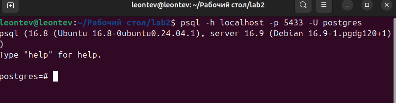
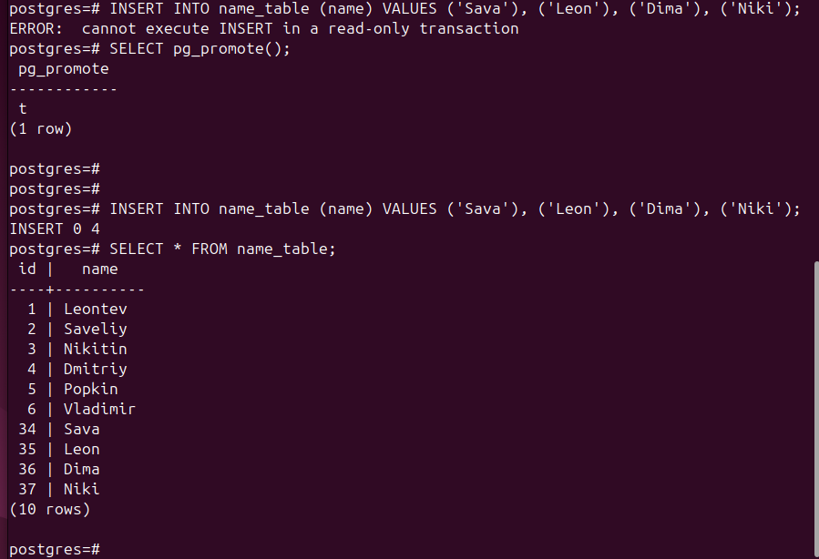

### Леонтьев С. В., Никитин Д. И. 
### Лабораторная работа №2

Поднимаем контейнеры
```shell
cd lab2
docker compose up -d
```


подключаемся к primary

```shell
psql -h localhost -p 5433 -U postgres
```


Создаём тестовые данные:
```psql
CREATE TABLE name_table (id SERIAL, name TEXT);
INSERT INTO name_table (name) VALUES ('Leontev'), ('Saveliy'), ('Nikitin'), ('Dmitriy'), ('Popkin'), ('Vladimir');
SELECT * FROM name_table;

```


Подключаемся к standby:
```shell
psql -h localhost -p 5434 -U postgres
```


Проверяем наличие данных:

```psql
SELECT * FROM name_table;
```


Проверяем, что доступно только чтение:

```psql
INSERT INTO name_table (name) VALUES ('Sava'), ('Leon'), ('Dima'), ('Niki');
```


Стопим `primary`
```
docker stop pg_primary
```


переводим standby в primary.
```psql
SELECT pg_promote();

INSERT INTO name_table (name) VALUES ('Sava'), ('Leon'), ('Dima'), ('Niki');
SELECT * FROM name_table;

```

