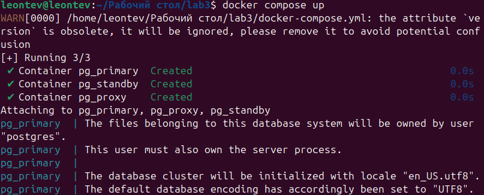
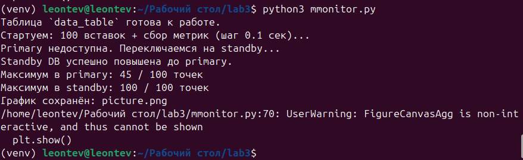
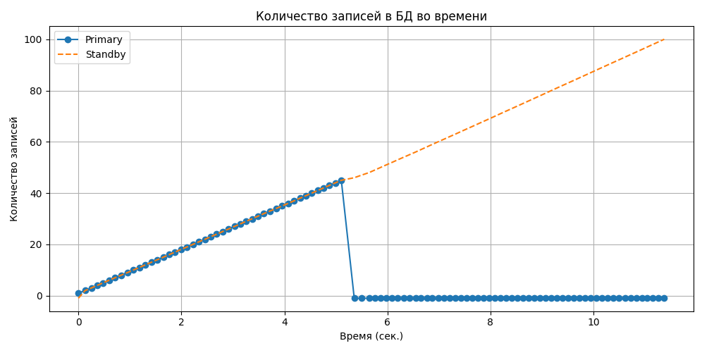

### Леонтьев С. В., Никитин Д. И. 
### Лабораторная работа №3


Поднимаем контейнеры
```shell
docker compose up
```


Создаем и активируем виртуальное окружение Python:

```shell
python3 -m venv venv
source venv/bin/activate
```
Установим:
```python
pip install psycopg2-binary matplotlib
```
Создадим скрипт 'mmonitor.py' который будет выполнять автоматический тест, который при сбое primary переключается на standby, собирает метрики числа записей и выводит их динамику на одном графике. Состоит из:

Класс MetricsCollector
1.	Хранит списки: timestamps (время), primary_rows и standby_rows (число записей).
2.	_row_count(db) → SELECT COUNT(*) из data_table.
3.	collect() добавляет текущее время и оба счётчика.
4.	visualize() строит график, выводит максимумы, сохраняет в picture.png и вызывает plt.show().

Класс SmartInserter
1.	Флаг use_primary выбирает, куда писать (по умолчанию – primary).
2.	_try_insert(db, val) пытается вставить запись в заданную БД.
3.	switch_to_standby() → SELECT pg_promote() на standby, делая его новым primary.
4.	write(val) сначала вставляет в primary; при неудаче переключается на standby и продолжает туда.

Основная main()
1.	Создаёт SmartInserter и MetricsCollector.
2.	Вызывает setup_table().
3.	В цикле 100 раз:
    •	write() → вставка,
    •	collect() → лог,
    •	sleep(0.1).
4. По окончании или Ctrl+C — visualize() строит график.


Теперь запускаем mmonitor.py, а далее стопим primary командой:
```shell
python3 mmonitor.py
```
```shell
docker stop pg_primary
```
Через пару секунд (не больше 10) программа завершается, а на выходе создает график. 



Итого:

